---
title: "Digitech security assessment"
author: [HAN23080181, HAN23080514, HAN23100188, HAN23100107, HAN23080227]
date: "2025-05-02"
subject: "Markdown"
keywords: [Markdown, Example]
lang: "en"
titlepage: true
titlepage-rule-height: 0
titlepage-background: "background1.pdf"
toc-own-page: true
...
# I. Introduction

You, Digitech Corporation have contracted us to assess your physical and digital security at your Hualon building location. In this assessment, we will take a look at physical security, conduct a penetration testing of your network, review your assets and security controls and then we will give you security recommendations and how to mitigates your security flaws.


# II. Physical Security Assessment

A special foundation is needed as DigiTech Corporation enters a new phase of growth and relocates to a new location because now, leaving the old building, could be seen as much more than just a physical relocation act but rather an opportunity for strengthening and reinforcement of both digital and physical security. This would lead into an extended section on the strategic implementation of infrastructure security solutions, logical and physical which gets to the core of CIA-triad principles: Confidentiality, Integrity, and Availability, alongside the business classification model that defines sensitivity levels of data and systems into Highly Sensitive, Internal or Public (Whitman and Mattord, 2022).

## 2.1. Logical security

Logical infrastructure security is a collective umbrella for a worldwide range of software safeguards, access policies, and networking protocols that must protect all the digital hardware by unauthorised interference or compromise. Considering the vastness of DigiTech's presence that goes from the Cyber Security Intelligence Lab over Application Development Lab and many other departments dealing with sensitive data, there must be much sophisticated level of logical security implemented (Stallings, 2020).

## 2.2. Network Security

A resilient, segmented, and well-monitored network structure forms the bedrock of logical security at the new DigiTech facility. Each of the operational units, including the Cyber Lab on the 8th floor, the Development Lab on the 7th, and the Data Center on the 6th floor, will be equipped with their own Virtual LAN (VLAN), to minimise lateral spread of emergent threats and increase independence among departments. Besides that, VLAN segmentation typically increases performance and improves security by reducing traffic confinement into specific areas.

Enterprise-grade firewalls, Intrusion Detection Systems (IDS), and Intrusion Prevention Systems (IPS) must be deployed at every digital point. These instruments build a dynamic line of defence that allows real-time detection and neutralisation of unauthorised access attempts, malware intrusions, and other security incidents (SANS Institute, 2021). Therefore, secure communication channels must be provided for remote users and administrators. Multiple-Factor Authentication (MFA)-based Virtual Private Networks (VPNs) will be provided for access where necessary from off-site locations to safeguard traffic generated from those sites against external cyber threats (Andress, 2019).

## 2.3. Access controls 

A complete access control process from end to end can be built via Role-Based Access Control (RBAC) management. Applies only to data and systems needed for the fulfilment of their roles. This policy follows the principle of least privilege, which is one of the best foundational practices to minimise risk through unnecessary permissions.
For instance, users can not only log in but also be validated through an added level, like biometrics or time-based one-time passwords (TOTP). In addition, audit logging and tracking of user activities can also offer necessary functionalities for analysis, incident response, or regulatory compliance (NIST 2020).

## 2.4. Data Protection and Encryption

Sensitive data such as patron databases, secret algorithms, intellectual property, as well as people records require encryption at rest and in transit. All stored data should use Advanced Encryption Standard (AES-256) while items that are in transit should use protocols based on Secure Socket Layer (SSL) and Transport Layer Security (TLS) (Stallings, 2020).

## 2.5. Physical Infrastructure Security

Just like in the digital world, the security of physical assets—from servers and workstations to networking equipment and employee workspaces- is very important to preserve operational reliability and data integrity. The physical security strategies thus control physical access to sensitive equipment, environmental stability, and deter malicious activity.

## 2.6. Surveillance and Monitoring

Video surveillance is a widely used method of security in modern times. Hence, high-resolution CCTV cameras must be installed at all access points, including building entrance and emergency exit pathways, internal corridors, and entering critical rooms such as laboratories and Data Center. A centralised Camera Control Room on the 6th floor will monitor all these feeds in real time. Video recordings should be encrypted and archived with limited access and retention policies, allowing for use in forensic investigations where necessary. 

## 2.7. Environmental Controls

The data-handling environments and the Data Centers must be maintained against environmental hazards. FM-200 fire suppression system provides the fire extinguishing capability without causing any damage. Temperature and humidity levels should be continuously monitored, thus adjusted through automated HVAC systems to maintain the equilibrium and prevent malfunction or degradation of the equipment. In addition, an uninterruptible power supply (UPS) system must be implemented to cushion against loss of data and facilitate the smooth power transition during outages (Andress, 2019).

## 2.9. Device and Infrastructure Security

All end-user devices and network components must be anchored properly to prevent theft or tampering with more than 150 computers and 15 printers. Server racks need to be lockable, with access permitted only to authorise technical personnel. Cables must be placed in tamper-proof conduits and routed through secure paths to lessen risk due to interception or sabotage (ISO/IEC, 2022). An automated asset inventory management application would scan and help monitor all hardware components. Periodic audits will ensure the existence of each item, their condition, and whether they are in use or not, helping to identify anomalies and discourage potential insider threats (SANS Institute, 2021).

## 2.10. Application of the CIA Triad

DigiTech adopts an infrastructure security approach directly linked with the CIA triad, an information security key concept on which all protective measures are based. 
Confidentiality is maintained using data encryption, RBAC policies, MFA mechanisms, and access controls. These practices ensure that only vetted and authorised users can interact with sensitive datasets, proprietary software, and customer information (Whitman and Mattord, 2022). Integrity is assured by employing mechanisms that guarantee the accuracy and completeness of information-in essence hashing algorithms, accessing logs, and structured updating procedures that avoid unauthorised modification (Stallings, 2020). Availability is reinforced through provisions such as power supply redundancy, proactive backup strategy, strong network architecture, and well-documented recovery procedures to ensure that data and digital services can be accessed any time they are needed for business operation (NIST, 2018).

## 2.11. Business Classification Model Alignment

Security at DigiTech is further enhanced by its business classification model, which governs the level of protection each type of data asset requires. This three-tier model demands utmost precision and efficiency when handling corporate resources (Whitman and Mattord, 2022):
- Highly Sensitive - The data in this category includes intellectual property, customer data, authentication credentials, and surveillance recordings. Due to their critical importance, they must be heavily encrypted, access-controlled, and closely monitored. 
- Internal- This group contains operational data, such as system logs, performance reports, and technical documentation. This information is not for public consumption, but it still calls for some protection, limited access, and some form of security logging.
- Public: This designation covers press releases, marketing materials, and web content available to the public. Because the need for confidentiality is minimal, efforts should be made to protect these asset parameters from defacement or unauthorised alteration.

## 2.12. Conclusion 

The relocation of DigiTech Corporation, which is synonymous with infrastructure security improvements, necessitates a careful alternative view of the assessment and fortification of infrastructure security. The company protects its valuable digital assets while ensuring business continuity and regulatory compliance by adopting a multi-layered defence approach that incorporates both logical and physical safeguards. The integration of the CIA triad and business classification model in all security-related spearheads prepares DigiTech to be a long-term success. This forward-looking approach, rather, decreases risks while fostering a haven for innovations and growth.


# III. IT Security and Risk Assessment
## 3.1. Assessment methodology
To further test your IT security, we have opted to conduct a gray box test on your internal systems. A gray box pentest is when a pentest is given limited intelligence or access in the target system (Shebli & Beheshti, 2018). This is to simulate an "assume breached" scenerio in the event that hackers managed to compromise a single endpoint system by the usage of C2s (Command and Control) or by the usage of RDP like the case of lapsus$, where they used compromised credentials from insiders or a social engineering job to wreck havoc on NVIDIA, Okta, etc (CISA, 2023). 

\newpage

## 3.2. Initial Access

With your permission, we were given an unmarked windows machine (WS01) to start with: 

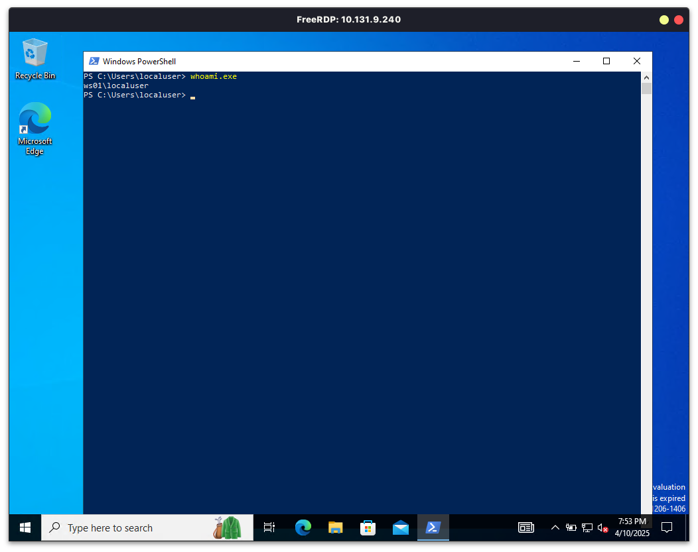

The first thing we would do is to install a pivoting tool in order to access the internal network in the 192.168.56.0/24 subnet, we gonna use reverse-ssh by Fahrj (https://github.com/Fahrj/reverse-ssh) to act as a reverse ssh server within the network and as a pivoting proxy for proxychains. Proxychains is the tool we use to allow Linux tools to work with SOCKS proxy.


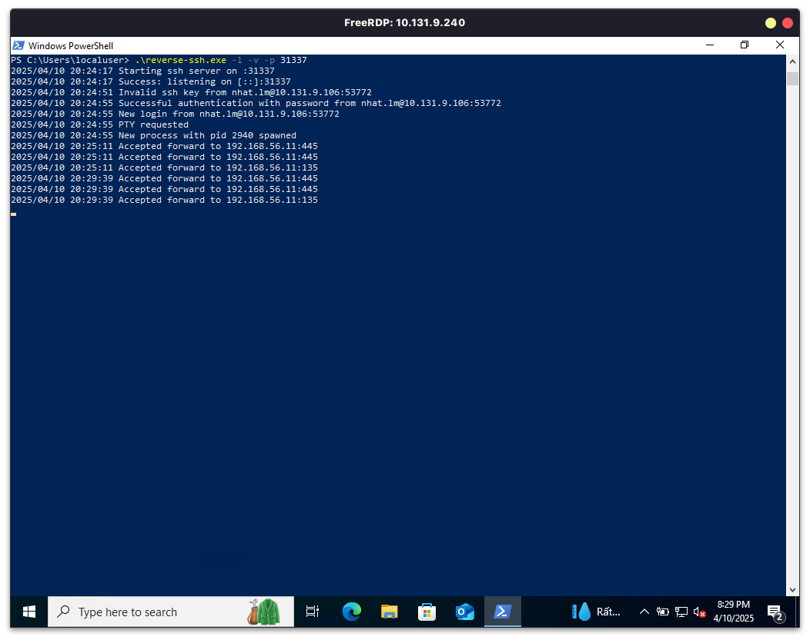

\newpage

After we got reverse-ssh running on the system, we can now ssh in ```ssh -D 9050 -p 31337 10.131.9.240```. The proxy is now running at 127.0.0.1:9050 on the attacker machine, which is proxychains's default option.

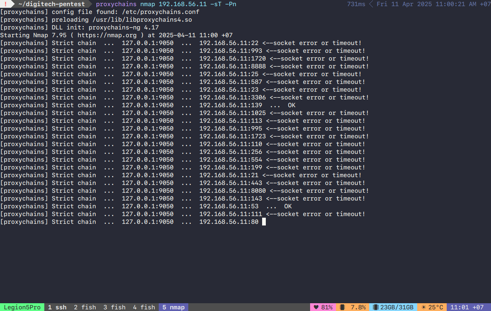

\newpage

## 3.3. Internal network enumeration

After a while of running nmap with the `-st` and `-Pn` to disable host discovery, we discovered there server hosts: 

```
Nmap scan report for 192.168.56.10
Host is up (0.00018s latency).
Not shown: 985 closed tcp ports (conn-refused)
PORT     STATE SERVICE
53/tcp   open  domain
80/tcp   open  http
88/tcp   open  kerberos-sec
135/tcp  open  msrpc
139/tcp  open  netbios-ssn
389/tcp  open  ldap
445/tcp  open  microsoft-ds
464/tcp  open  kpasswd5
593/tcp  open  http-rpc-epmap
636/tcp  open  ldapssl
3268/tcp open  globalcatLDAP
3269/tcp open  globalcatLDAPssl
3389/tcp open  ms-wbt-server
5985/tcp open  wsman
5986/tcp open  wsmans

Nmap scan report for 192.168.56.11
Host is up (0.00026s latency).
Not shown: 986 closed tcp ports (conn-refused)
PORT     STATE SERVICE
53/tcp   open  domain
88/tcp   open  kerberos-sec
135/tcp  open  msrpc
139/tcp  open  netbios-ssn
389/tcp  open  ldap
445/tcp  open  microsoft-ds
464/tcp  open  kpasswd5
593/tcp  open  http-rpc-epmap
636/tcp  open  ldapssl
3268/tcp open  globalcatLDAP
3269/tcp open  globalcatLDAPssl
3389/tcp open  ms-wbt-server
5985/tcp open  wsman
5986/tcp open  wsmans

Nmap scan report for 192.168.56.22
Host is up (0.000095s latency).
Not shown: 992 closed tcp ports (conn-refused)
PORT     STATE SERVICE
80/tcp   open  http
135/tcp  open  msrpc
139/tcp  open  netbios-ssn
445/tcp  open  microsoft-ds
1433/tcp open  ms-sql-s
3389/tcp open  ms-wbt-server
5985/tcp open  wsman
5986/tcp open  wsmans

```

From the scan, we can determine that there is a CI/CD and file server, and 2 domain controllers. Additionally there were a camera system but it was beyond the scope of this test per your request.

After wards we ran them through netexec to determine the hostname, roles and domain of the machine:

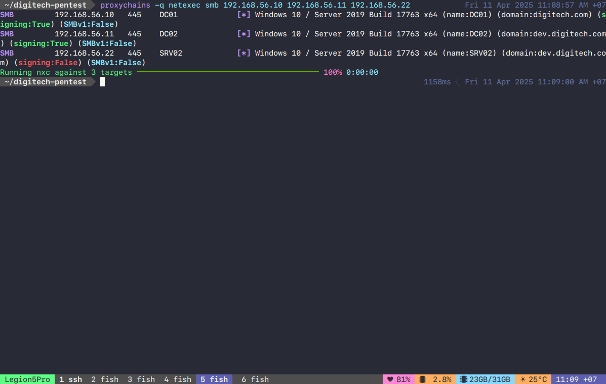

\newpage

From the netexec scan we can draw a relationship graph for all three of the top servers: 


\newpage

Next, we looked around for any protential entry point and we found out that the dc02 domain controller allows for RPC anonymous bind. RPC is short for Remote Procedure Call, which is a protocol that would allow a client/server relationship between processes locally or over the network over "pipes" (Jonathan, 2021), one of them is MS-SAMR, which allows for remote account management. In this case, we can abuse the anonymous user (null login) with rpcclient to enumerate users and their descriptions: 


\newpage

After taking a closer look at the users, we spotted user ```samwell.tarly``` with their password in their description: 


\newpage

## 3.4. Domain lateral movement on dev.digitech.com

Running the account through netexec showed that `samwell` can Remote Desktop into SRV02. 


\newpage

Next, we used SharpHound to collect all information of the dev.digitech.com Domain with the authenticated account:


\newpage

Then, we parsed the file through BloodHound to turn the data into graphs so that we can determine the "relationship" the objects (users, groups, etc) have with each other in the domain. 


\newpage

When we inspected the current user, we found out that they have full control over the "DefaultWallpaper" a Group Policy Object. 


In Windows, a Group Policy Object is a set of rules for user, groups and computers. These rules can range from default wallpaper, startup programs, what rights an user have locally on that computer, can they be local admin on, etc (Microsoft Learn). 


In this case, the ```DefaultWallpaper``` group policy object dictates the default wallpaper on DC02 and SRV02. With control of this group policy, we can hijack it to grant the current user local Administrator rights on DC02 and SRV02 with the usage of SharpGPOAbuse on SRV02 as samwell.tarly: 


After the GPO was updated, we waited 90 minutes and we can now login as the local Administrator for SRV02 and DC02:


With local admin right on DC02, we can now dump all of the known domain NTLM credentials using the secretsdump script from the impacket packages that will dump domain credentials from NTDS.dit on the domain controller: 


While many of these NTLM hashes are uncrackable, they can be used for PtH (Pass the Hash) attacks on Windows.

## 3.5. Cross-Forest Lateral movement to digitech.com

As shown in Figure 3.4.4, dev.digitech.com and digitech.com is part of the same "Forest". In Active Directory, a forest is a collection of AD domains that share the same basic schema or second level domain names (Microsoft). In order for users from either of these domains to use each other resources, both domain can trust other, unidirectionally or bidirectionally. 

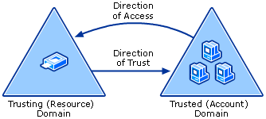

If domain A "trust" domain B, then domain B can access other's resources and vice versa.  

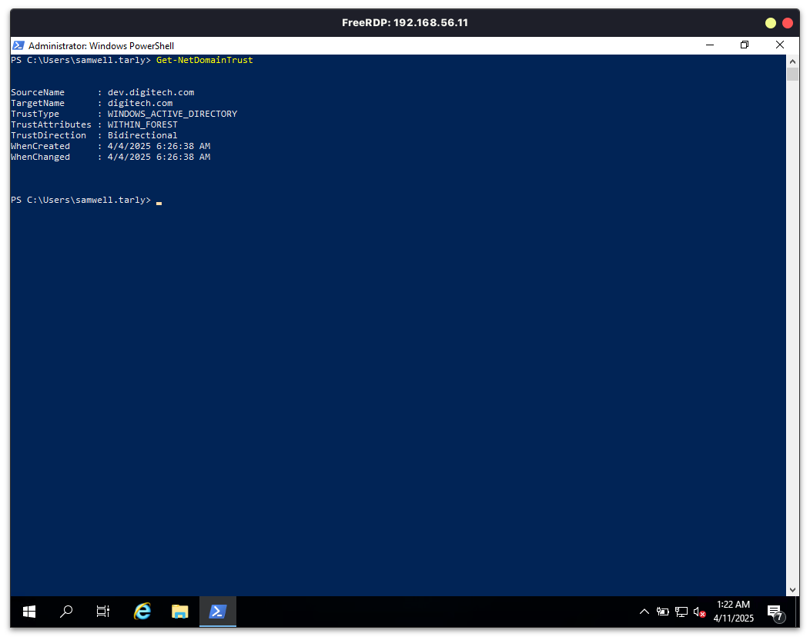

In this case, since digitech.com and dev.digitech.com trust are bidirectional, we can attempt to break into digitech.com. As shown on figure 3.4.9, one of the account we got from dc02.dev.digitech.com was named DIGITECH$, this is the "trust" account that is neeeded for cross-domain kerberos authentication, and with it, we can forge a fraudulent ticket-granting-ticket with a SIDHistory attribute containing the SID (Security Identifier) value of digitech's.com Domain Admin. SIDHistory is a feature that would retain an object's previous SID (security identifiers) when an object is migrated from another domain, attackers can abuse this attribute features to impersonate Domain Admin (Prasad, 2024)

 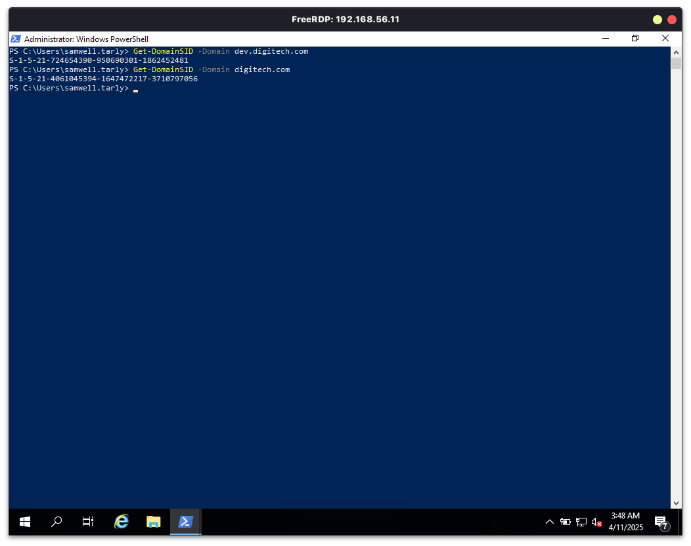

With the antivirus disabled on DC02, we can use mimikatz the first generate our fraudulent TGT:

 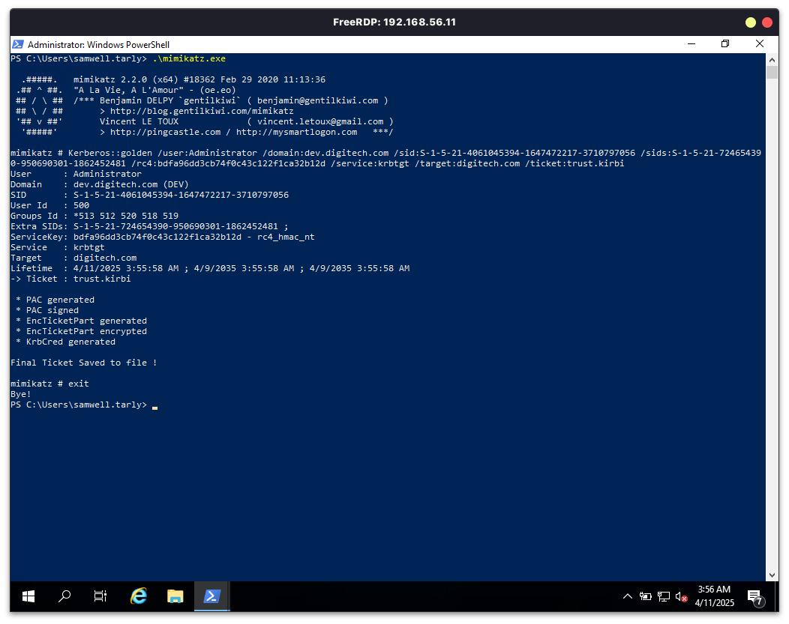

With the TGT saved as trust.kirbi, we can next utilize Rubeus to request a TGS (Ticket Granting Service) with the service principal name of `cifs/dc02.digitech.com`: 

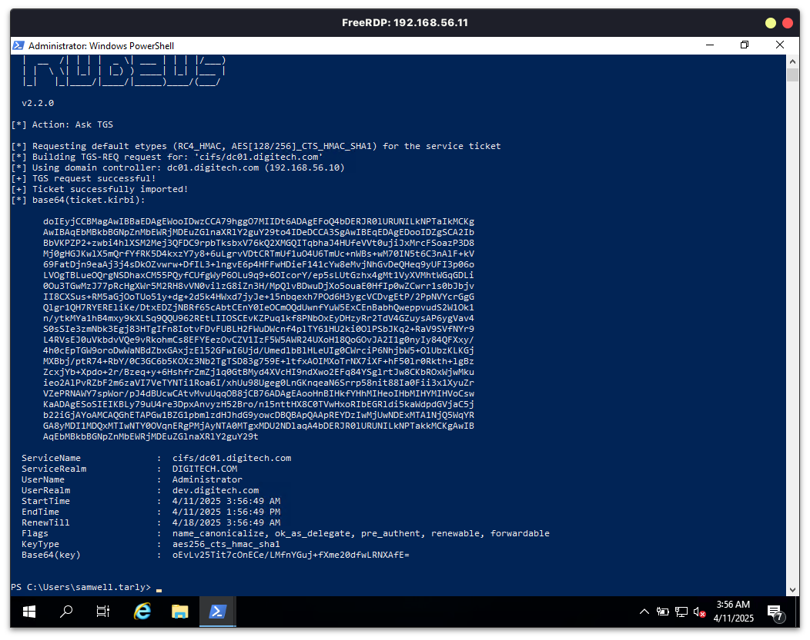

With the CIFS (Common Internet File System) ticket in memory, we can try to access the C$ share on DC02: 

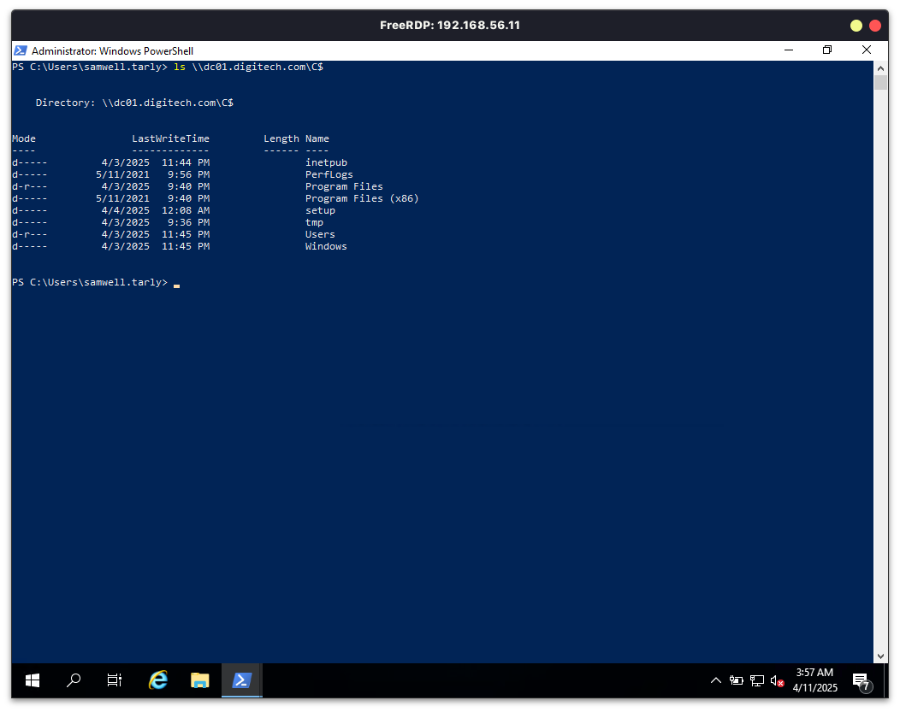

Next, to gain code execution on DC01.digitech.com, we can use PsExec, which uploads an reverse shell executable to the ADMIN$ share, then, it will start a service that will return a shell (Mitre). 

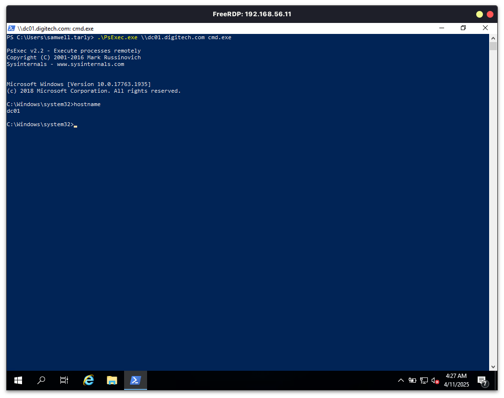
 
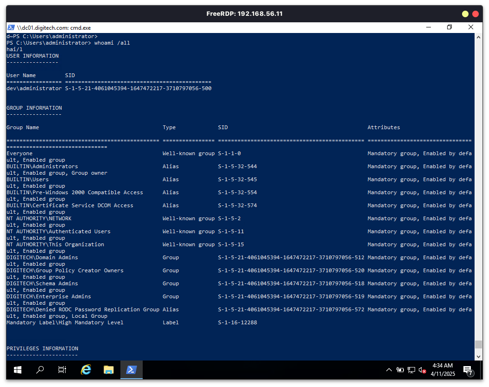

With admin rights on DC01, we can now use `reg save` to dump the SAM and SYSTEM hive from the registry and then exfiltrate it to extract the credentials of the local Administrator account for a NTDS.dit credential dump:

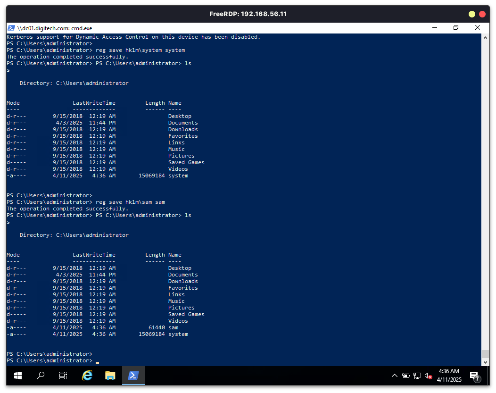

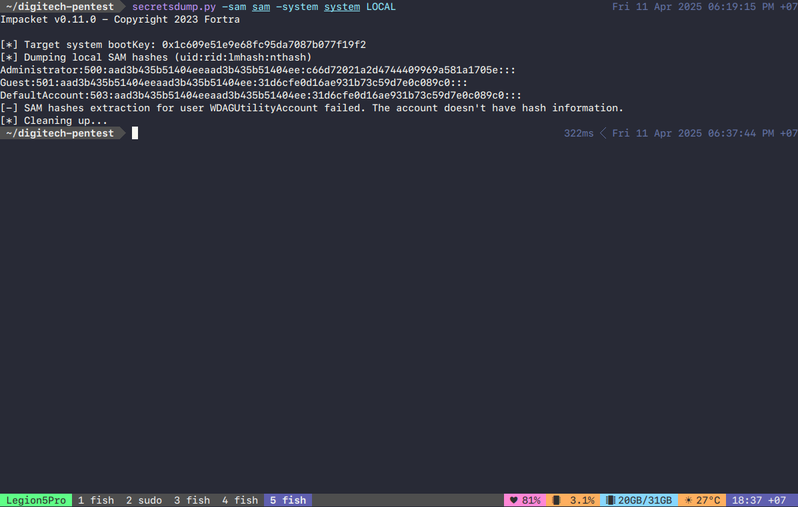

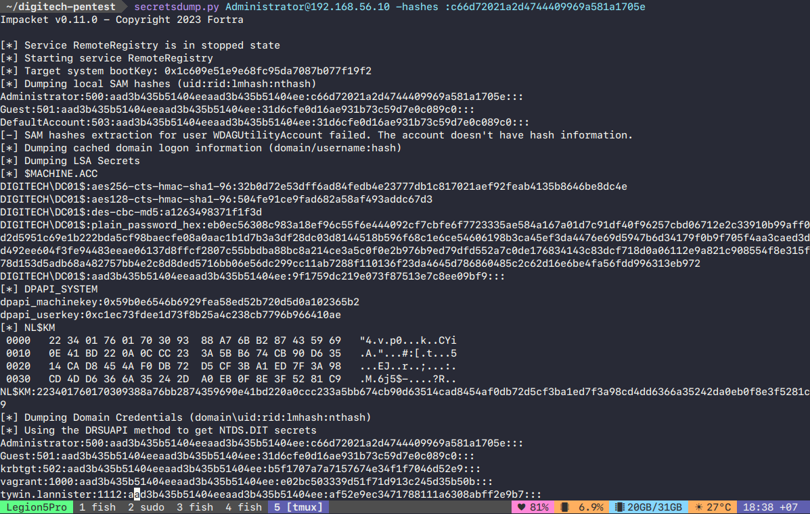

And we had successfully compromised both digitech.com and dev.digitech.com domain.

# IV. Assets and Security Controls Assurance Review

## 4.1. Overview of Organizational Assets

In perspective of organization security and operational resilience, ensuring CIA (Confidentially, Integrity, Availability) triad is a critical point to protect important assets such as sensitive information, network infrastructure, and computer system. The resources of an organization are usually classified to effectively manage and ensure the continuity of the business. These include, but are not limited to, the following:

### 4.1.1.  Physical Access Infrastructure

Components such as RFID card, electric security door, biometric identity, CCTV surveillance equipment, and perimeter security alarms, required for control and monitor physical access to sensitive space such as data centres, server rooms, and administrative zones.

### 4.1.2. Information Technology and Computing Systems

This category includes assets which are critical for both operational and administrative functions of the enterprise such as end-point devices (desktops, laptops, tablets), virtual machine hosts, application servers, file servers, domain controllers, and specialized appliances (backup servers and hypervisors).

### 4.1.3. Networking and Communications Infrastructure

This category encompasses a set of network devices such as switches, routers, firewalls, wireless access points, and cabling infrastructure. These resources are basis and essential architecture to establish internal also external communication, enabling service delivery and data exchange.

### 4.1.4. Digital Data Repositories

Including physic and non-physic data storage across organization’s system encompass file systems, relational databases, document management systems, and cloud repositories. Additionally, this category includes sensitive data of businesses and their employees such as customer data, financial records, employee information, proprietary source code, and business intelligence assets.

### 4.1.5. Backup and Recovery Systems

Consist of local and offsite backup server, cloud-based disaster recovery plan, and tape storage systems. These backups and storages play crucial role in business to ensure its continuity during catastrophic events such as cyberattack, natural disaster, or hardware failure.

### 4.1.6.  Security Monitoring and Management Platforms

Including tools and platforms to monitor, detect, analyse, and response to cyberattack such as Security Information and Event Management (SIEM), intrusion detection/prevention systems (IDS/IPS), vulnerability scanners, and endpoint detection and response (EDR).
 
Given their business-critical nature, each of these asset classes must be safeguarded with controls proportional to their risk exposure and threat likelihood.

## 4.2. Security controls in Place 

To mitigate internal and external threats, various organizations have implemented Multi-layered and defence-in-depth security framework. These can divide into various categories:

### 4.2.1. Physical Security Controls

The organization maintains access control to sensitive areas through RFID card-based authentication systems and camera security system, especially the data centre and network operations centre. Visitor access will be restricted through the applied protocols and on-site supervisors. Despite these actions, there are still threats such as insider or RFID card cloning.

### 4.2.2. Endpoint and Host-Based Protections

Antivirus software and Endpoint Detection and Response (EDR) solutions are being applied to all endpoint devices to monitor including log forensic evidence for post-incident investigation, and quarantine malicious behaviours, detect unauthorized privilege escalation attempts. Additionally, USB is often elevated risk, so it will be banned based on company’s policies.

### 4.2.3. Patch Management and Vulnerability Scanning

Operating system and third-party applications are updated regularly to patch the security weaknesses that exist in the previous upgrade. Security Vulnerabilities are conducted quarterly to ensure; however, the infrastructure still exist legacy systems that still have security weakness that can be exploited by threats such as WannaCry, Lockbit, etc.

### 4.2.4. Network Segmentation and Perimeter Defences

Thousands of organizations implement Virtual LANs (VLANs) and Access Control Lists (ACLs) to their internal network to mitigate internal threats such insiders, human errors. Firewalls are implemented to enforce the security between zones to limit lateral movement between non-sensitive and sensitive areas. The sensitive areas are further hardened through intrusion prevention/detection systems.

### 4.2.5. Authentication and Access Controls

Enterprises implement Role-Based Access Control (RBAC) across systems and users based on the principle of minimal privilege. In addition, MFA or Multi-Factor Authentication is applied to enforce the privilege of account, and remote access tunnels. Password policies mandate periodic rotation, complexity requirements, and account lockouts upon excessive failed attempts.

### 4.2.6. Security Monitoring and Incident Response

Collecting log from essential devices such as endpoints, network devices, and authentication systems via SIEM platform. SIEM are configured to automate alert anomalous behaviours such as port scanning, repeated failed logins, or privilege escalation. In addition, SIEM platform also log incident response procedures and periodically evaluated.

## 4.3. Best-Case Threat Model

### 4.3.1. Threat Scenario: Unauthorized Access via Low-Level Credential Compromise

In this ideal scenario, an attacker gains access to organization’s network through low-privileged user with a set of valid credentials associated. For example, in Active Directory, user with NTML misconfiguration, allowing attackers to authenticate or relay credentials without knowing the user's password. This may occur via phishing, credential stuffing, or data leakage from unrelated third-party breaches.

### 4.3.2. Threat Pathway and Limitations

- Initial Access:

The malicious actor gain access to organization’s system through misconfiguration user or leverages stolen credentials to log in via a corporate VPN or endpoint workstation.

- Reconnaissance:

The attack attempts to identify network infrastructure such as DNS server, shared drives, and vulnerable hosts. In this phase, tools such as Nmap, netstat, ping are used by attacker to visualize network structure of this organization.

- Privilege Escalation Attempts:

Lacking administrative privileges or misconfigured authentication enable attacker to exceed privilege through a technique called privilege escalation. However, these are blocked by EDR runtime detections and restricted user policies.

- Propagation Blocked:

Network segmentation is implemented to prevent lateral movement; thus, the attacker cannot access or collect information beyond the user’s assigned zone.

- Detection and Response: 

SIEM platform will flag any usual login patterns and lateral movement attempts. Security personnel isolate the affected device, reset the compromised credentials, and conduct forensic review.

### 4.3.3. Impact Assessment

- Confidentiality: Maintained — no sensitive data accessed.

- Integrity: Maintained — no unauthorized changes made.

- Availability: Maintained — services remain operational.

- Reputational Impact: Negligible.

### 4.3.4. Risk classification

Low – Defense mechanisms operated effectively to prevent compromise escalation.

## 4.4. Worst-Case Threat Model

### 4.4.1. Threat Scenario: Physical Intrusion and Network Implant Leading to Ransomware Deployment

In this case, an attacker successfully bypasses security controls by mimic an employee’s RFID card signal. This exploitation happens because of human errors such as losing the card. Thus, threat actors gain unauthorized access to the building and proceed to install a covert network implant inside the server room.

### 4.4.2. Threat Pathway and Compromise

- Physical breach: 

The hacker has permission to enter sensitive areas by using cloned RFID card. Although, CCTV systems record entry, the breach goes unobserved due to the absence of real-time monitoring and analytics. 

- Physical implant deployment 

Devices such as Raspberry Pi or Intel NUC create a secure VPN tunnel or command-and-control (C2) channel to access to organization’s network without trait.

- Internal Reconnaissance and Exploitation

Some legacy servers such as Windows 7 or Server 2008 with full vulnerabilities and SMBv1 enabled enable attacker to exploit through EternalBlue vulnerability.

- Ransomware Execution

Ransomewares like WannaCry or Lockbit is deployed and rapidly self-propagates through the internal network, exploiting other vulnerable machines via SMB. Systems are locked, and critical files across departments are encrypted.

- Operational Disruption

Files become inaccessible, user endpoints display ransom notes, mission critical systems like security cameras and RFID card system, ... become inoperative.

### 4.4.3. Impact Assessment

- Confidentiality: Compromised – sensitive data could be exfiltrated prior to encryption.

- Integrity: Severely impacted – data is altered and inaccessible.

- Availability: Destroyed – widespread system outages across all business units.

- Reputational Impact: High – customer trust eroded; legal and regulatory consequences likely.

### 4.4.4. Control Failures identification

- Physical Security: Ineffective RFID anti-cloning measures and lack of real-time intrusion detection

- Patch Management: Existence of unpatched, unsupported operating systems vulnerable to known exploits.

- Network Segmentation: Insufficient isolation allowed lateral movement of the ransomware.

- Monitoring Deficiencies: Network implant went undetected, suggesting a lack of device registration policies or anomaly detection at the MAC layer.

### 4.4.5. Risk Classification

**Critical** – The convergence of physical and cyber threats leads to catastrophic business disruption.


# V. Mitigations and Security Recommandations

## 5.1. Mitigations

In this section, we will talk about how to mitigates the critical security vulnerbilities we found during our penetration test.

- T1087: Account Discovery

In this case, attacker had managed to interact with the SAMR pipe in the RPC service with a "null", or an anonymous bind. To mitigate this, administrators should enfore the "Restrict anonymous access to Named Pipes and Shares" group policy domain wide to restrict unauthenticated access to Shares and Named Pipes. (MITRE)

- T1090: Proxying

In this case, the attacker had managed to use a reverse proxy in the form of the reverse-ssh tool to further gain access into the internal network. To mitigate and detect these kind of attacks, administrators should employ IDS (Intrusion Detection Systems) and IPS (Intrusion Prevention Systems) to detect proxying attempts. 

- T1552: Unsecured Credentials

In this case, the attacker managed to obtain a plaintext credential of a special account and used it to move laterally on the domain. To mitigate and prevent this, administrators should preemptively audit for any and all plaintext passwords in documents, text files on company SMB shares and educate users about the risk of storing plaintext passwords on their computers and servers (MITRE). 

- T1484.001: Group Policy Modification

In this case, the attacker abused an user account with complete control over a Group Policy Object that affects the SRV02 and DC02 servers, leading to the attacker granting themselves Admin rights and eventually compromise the entire Domain. To mitigate this, administrators needs to ensure that the only user accounts that can control GPOs are Domain Admins. (MITRE)

- T1558.001 and T1134: Cross-domain golden ticket

As the Administrator on DC02, the attacker managed to obtain the trust credentials of the digitech.com Domain, allowing the attacker to forge a cross domain trust ticket with an SID-History attribute of Digitech's Domain Admin, effectively granting them control over the digitech.com domain. To mitigate this, Administrators on the digitech.com should enable SID Filtering for cross-trust authentication to automatically filter out SIDHistory (MITRE). 


## 5.2. Security policies recommandations

### 5.2.1. Access Control Policy

To reduce the potential of a rogue account like our user account, the admins should use the principle of least privilege, allowing authorized access for only users which are necessary to accomplish assigned tasks in accordance with organizational missions and business functions, and restrict the usage of those accounts. For example, permissions to edit GPOs that apply to critical servers like DC02 and SRV02 should be tightly restricted and routinely audited. If this can disrupt the flow of the company by taking away some privileges that are needed at the moment, for example needing to access certain high-privileged files, designate individuals authorized to post information onto a publicly accessible information system (NIST).

### 5.2.2. Remote Access Policy

Recall that this entire attack happens because the guest user could use ssh without extra privileges, from now on always ensure that the information system monitors and controls remote access methods. Any method of remote access must use a centrally managed authentication system for administration and user access. Turn off services when unnecessary, like the example above. If services like ssh have to be allowed, then when a remote access device will have access to other networked devices on the internal network, the remote device must be authenticated such that configuration of the device is compliant with applicable policies (NIST).

### 5.2.3. Authentication Policy

This policy might be overkill, but admins could consider implementing multifactor authentication for network access to privileged accounts. For Windows Users, Duo MFA login from Cisco can be installed to make sure no bad actors can get in with just passwords. Speaking of passwords, enforce everyone to set up complex passwords, with the usual unique characters, numbers, capitalized letters, and so forth. Also remember not to let them put their passwords in the description (NIST).

### 5.2.4. Endpoint Security Policy

Going along with all the above, there should be controls that help maintain the integrity of systems and information. Prestigious IDSs, IPSs, and SIEMs could be configured inside the network, with little to no drawbacks (NIST).

### 5.2.5. Incident response Policy 

In case of an ongoing attack inside your system, it is in your best interest to prepare a functional, up to date incident response plan, with detailed roadmaps, teams dedicated for the task, defined resources and management support needed to effectively maintain and mature an incident response capability, and was reviewed and approved by experts in this field.

Here are some of the actions that could be used in that plan: personnel trained in incident responses — through regular simulations and automated training tools — should act swiftly, reporting the incident within the defined timeframe and escalating it to the appropriate authorities. Automated mechanisms should be employed to track, collect, and analyze incident data in real time. Coordination with Business Continuity, Disaster Recovery, and Crisis Communication Plans is crucial to minimizing damage from the threat. Throughout the response, dedicated incident response support teams must advise users and assist in handling and documenting the incident, ensuring that lessons learned contribute to continuous improvement of the organization’s resilience. Make sure that all actions have to align with the organization's plan (NIST).

### 5.2.6. Security Awareness Training Policy

Finally, to stop preventable problems like putting the password inside your description, your employees must also be up to date on security as well. If there are signs of ignorance, that employee must go through mandatory security training, covering secure coding, AD hygiene, file validation, phishing prevention, and so on. Higher Ups could force developers to heavily follow through a SDLC (Software Development Life Cycle) policy, which is a set of guidelines that integrates security best practices into every phase of the software development process — from planning to deployment and maintenance (Souppaya et al., 2022). 

The key components of a secure SDLC policy should look like:

1. Requirements Phase NIST (2022) Assessing security and privacy controls in information systems and organizations, CSRC. Available at: https://csrc.nist.gov/pubs/sp/800/53/a/r5/final (Accessed: 28 April 2025). 

* Identify security and compliance requirements early

* Include threat modeling and risk assessments

* Reference standards like OWASP ASVS, NIST, PCI-DSS, or ISO 27001

2. Design Phase

* Apply secure architecture principles (e.g., least privilege, defense in depth)

* Review data flow diagrams and apply threat modeling (e.g., STRIDE)

* Plan for secure authentication, authorization, and data encryption

3. Development Phase

* Enforce secure coding standards (e.g., OWASP Secure Coding Practices)

* Use code linters and static analysis tools (e.g., SonarQube, Semgrep)

* Avoid hardcoding secrets — use environment variables or secret managers

4. Testing phase 

* Conduct static and dynamic application security testing (SAST/DAST)

* Include vulnerability scanning, dependency checking (e.g., Snyk, OWASP Dependency-Check)

* Run manual code reviews or peer reviews focused on security

5. Deployment Phase

* Use infrastructure-as-code (IaC) with security controls baked in

* Scan containers and CI/CD pipelines for misconfigurations

* Deploy with least-privilege access and role-based controls

6. Maintenance Phase

* Continuously monitor for vulnerabilities (e.g., with SIEM)

* Patch known vulnerabilities quickly

* Conduct regular security audits and penetration tests


# VI. References

Shebli, H.M. and Beheshti, B.D. (2018) ‘A study on penetration testing process and Tools’, 2018 IEEE Long Island Systems, Applications and Technology Conference (LISAT), pp. 1–7. doi:10.1109/lisat.2018.8378035. 

Review of the attacks associated with lapsus$ and related threat groups executive summary: CISA (2023) Cybersecurity and Infrastructure Security Agency CISA. Available at: https://www.cisa.gov/resources-tools/resources/review-attacks-associated-lapsus-and-related-threat-groups-executive-summary. 

Jonathan, J. (2021) RPC for Detection Engineers. Available at: https://specterops.io/wp-content/uploads/sites/3/2022/06/RPC_for_Detection_Engineers.pdf (Accessed: 12 April 2025). 

Group policy API (no date) Microsoft Learn. Available at: https://learn.microsoft.com/en-us/previous-versions/windows/desktop/policy/group-policy-start-page (Accessed: 13 April 2025). 

Trust technologies: Domain and forest trusts (no date) Domain and Forest Trusts | Microsoft Learn. Available at: https://learn.microsoft.com/en-us/previous-versions/windows/it-pro/windows-server-2003/cc759554(v=ws.10)?redirectedfrom=MSDN (Accessed: 14 April 2025). 

Prasad, S.K. (2024) Domain trusts- A comprehensive exploitation guide. Available at: https://redfoxsec.com/blog/domain-trusts-a-comprehensive-exploitation-guide/ (Accessed: 15 April 2025). 

MITRE (no date) PSEXEC, PsExec, Software S0029 | MITRE ATT&CK®. Available at: https://attack.mitre.org/software/S0029/ (Accessed: 15 April 2025). 

MITRE (no date) Account discovery, Account Discovery, Technique T1087 - Enterprise | MITRE ATT&CK®. Available at: https://attack.mitre.org/techniques/T1087/ (Accessed: 22 April 2025).

Vinay , P. (no date) Network Access Restrict anonymous access to named pipes and shares - windows 10, Network access Restrict anonymous access to Named Pipes and Shares - Windows 10 | Microsoft Learn. Available at: https://learn.microsoft.com/en-us/previous-versions/windows/it-pro/windows-10/security/threat-protection/security-policy-settings/network-access-restrict-anonymous-access-to-named-pipes-and-shares (Accessed: 22 April 2025).

MITRE (no date) Proxy, Proxy, Technique T1090 - Enterprise | MITRE ATT&CK®. Available at: https://attack.mitre.org/techniques/T1090/ (Accessed: 22 April 2025).

MITRE (no date b) Unsecured credentials, Unsecured Credentials, Technique T1552 - Enterprise | MITRE ATT&CK®. Available at: https://attack.mitre.org/techniques/T1552/ (Accessed: 22 April 2025).

MITRE (no date a) Domain or tenant policy modification: Group policy modification, Domain or Tenant Policy Modification: Group Policy Modification, Sub-technique T1484.001 - Enterprise | MITRE ATT&CK®. Available at: https://attack.mitre.org/techniques/T1484/001/ (Accessed: 22 April 2025). 

MITRE (no date a) Access token manipulation: Sid-history injection, Access Token Manipulation: SID-History Injection, Sub-technique T1134.005 - Enterprise | MITRE ATT&CK®. Available at: https://attack.mitre.org/techniques/T1134/005/ (Accessed: 22 April 2025). 

MITRE (no date d) Steal or Forge Kerberos tickets: Golden Ticket, Steal or Forge Kerberos Tickets: Golden Ticket, Sub-technique T1558.001 - Enterprise | MITRE ATT&CK®. Available at: https://attack.mitre.org/techniques/T1558/001/ (Accessed: 22 April 2025).

Andress, J. (2019) The basics of information security: Understanding the fundamentals of InfoSec. 3rd edn. Syngress.
ISO/IEC (2022) 27001:2022 Information security, cybersecurity and privacy protection. Geneva: International Organization for Standardization. Available at: https://www.iso.org/isoiec-27001-information-security.html (Accessed: 14 April 2025).

National Institute of Standards and Technology (NIST) (2018) Framework for improving critical infrastructure cybersecurity, Version 1.1. Available at: https://nvlpubs.nist.gov/nistpubs/CSWP/NIST.CSWP.04162018.pdf (Accessed: 14 April 2025).

National Institute of Standards and Technology (NIST) (2020) Security and privacy controls for information systems and organizations (NIST Special Publication 800-53 Rev. 5). Available at: https://csrc.nist.gov/publications/detail/sp/800-53/rev-5/final (Accessed: 14 April 2025).

SANS Institute (2021) Critical Security Controls Version 8. Available at: https://www.cisecurity.org/controls/cis-controls-list (Accessed: 14 April 2025).

Stallings, W. (2020) Network security essentials: Applications and standards. 6th edn. Pearson.

Whitman, M.E. and Mattord, H.J. (2022) Principles of information security. 7th edn. Cengage Learning.

Cole, E., Krutz, R. L., & Conley, J. W. (2018). Network Security Bible (2nd ed.). Wiley.

Europol. (2018). Internet Organized Crime Threat Assessment (IOCTA) 2018. https://www.europol.europa.eu/

Garcia, M. L. (2008). The Design and Evaluation of Physical Protection Systems (2nd ed.). Butterworth-Heinemann.

ISO/IEC 27001:2022. (2022). Information security, cybersecurity and privacy protection — Information security management systems — Requirements.

Microsoft. (2017). Microsoft Security Bulletin MS17-010 – Critical. https://docs.microsoft.com/en-us/security-updates/securitybulletins/2017/ms17-010

Mitchell, R., & Chen, I. R. (2021). Adaptive Cyber Defense for the Internet of Things. Springer.

Mitnick, K. D., & Simon, W. L. (2011). The Art of Deception: Controlling the Human Element of Security. Wiley.

National Institute of Standards and Technology (NIST). (2010). Contingency Planning Guide for Federal Information Systems (SP 800-34 Rev. 1).

National Institute of Standards and Technology (NIST). (2012). Computer Security Incident Handling Guide (SP 800-61 Rev. 2).

National Institute of Standards and Technology (NIST). (2017). Digital Identity Guidelines (SP 800-63B)

Scarfone, K., & Mell, P. (2007). Guide to Intrusion Detection and Prevention Systems (IDPS) (SP 800-94).

Stallings, W. (2021). Network Security Essentials: Applications and Standards (6th ed.). Pearson.

Symantec. (2017). WannaCry Ransomware Attack: Analysis and Mitigation Strategies. https://symantec-enterprise-blogs.security.com/blogs/threat-intelligence/wannacry-ransomware-attack

Whitman, M. E., & Mattord, H. J. (2022). Principles of Information Security (7th ed.). Cengage Learning.

NIST (2022) Assessing security and privacy controls in information systems and organizations, CSRC. Available at: https://csrc.nist.gov/pubs/sp/800/53/a/r5/final (Accessed: 28 April 2025).

Souppaya, M., Scarfone, K. and NIST (2016) Guide to enterprise telework, remote access, and bring your own device (BYOD) security, CSRC. Available at: https://csrc.nist.gov/pubs/sp/800/46/r2/final (Accessed: 28 April 2025). 

NIST (2022) Assessing security and privacy controls in information systems and organizations, CSRC. Available at: https://csrc.nist.gov/pubs/sp/800/53/a/r5/final (Accessed: 28 April 2025). 

Souppaya, M., Scarfone, K. and Dodson, D. (2022) Secure software development framework (SSDF) version 1.1: Recommendations for mitigating the risk of software vulnerabilities, CSRC. Available at: https://csrc.nist.gov/pubs/sp/800/218/final (Accessed: 28 April 2025).
