---
title: "Digitech security assessment"
author: [HAN23080227]
date: "2025-05-"
subject: "Markdown"
keywords: [Markdown, Example]
lang: "en"
titlepage: true
titlepage-rule-height: 0
titlepage-background: "background1.pdf"
...
## I. Introduction

## II. Physical Security Assessment

## III. IT Security and Risk Assessment
#### 3.1. Assessment methodology
To further test your IT security, we have opted to conduct a gray box test on your internal systems. A gray box pentest is when a pentest is given limited intelligence or access in the target system (Shebli & Beheshti, 2018). This is to simulate an "assume breached" scenerio in the event that hackers managed to compromise a single endpoint system by the usage of C2s (Command and Control) or by the usage of RDP like the case of lapsus$, where they used compromised credentials from insiders or a social engineering job to wreck havoc on NVIDIA, Okta, etc (CISA, 2023). 

#### 3.2. Initial Access

With your permission, we were given an unmarked windows machine (WS01) to start with: 

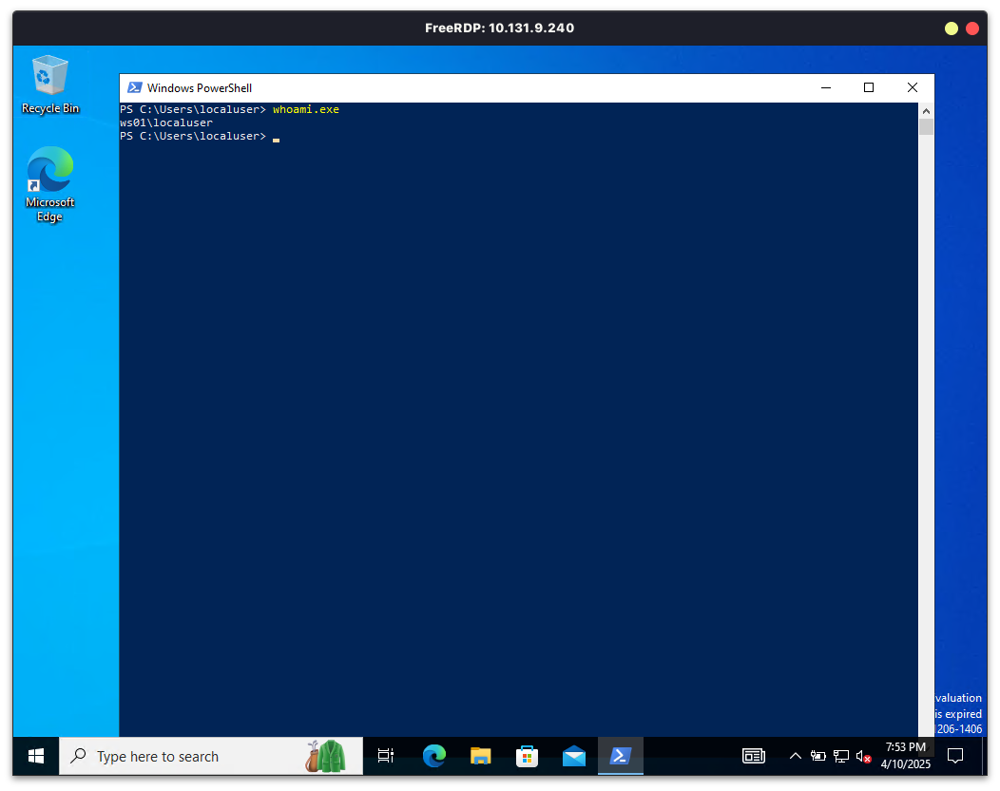

The first thing we would do is to install a pivoting tool in order to access the internal network in the 192.168.56.0/24 subnet, we gonna use reverse-ssh by Fahrj (https://github.com/Fahrj/reverse-ssh) to act as a reverse ssh server within the network and as a pivoting proxy for proxychains. Proxychains is the tool we use to allow Linux tools to work with SOCKS proxy.


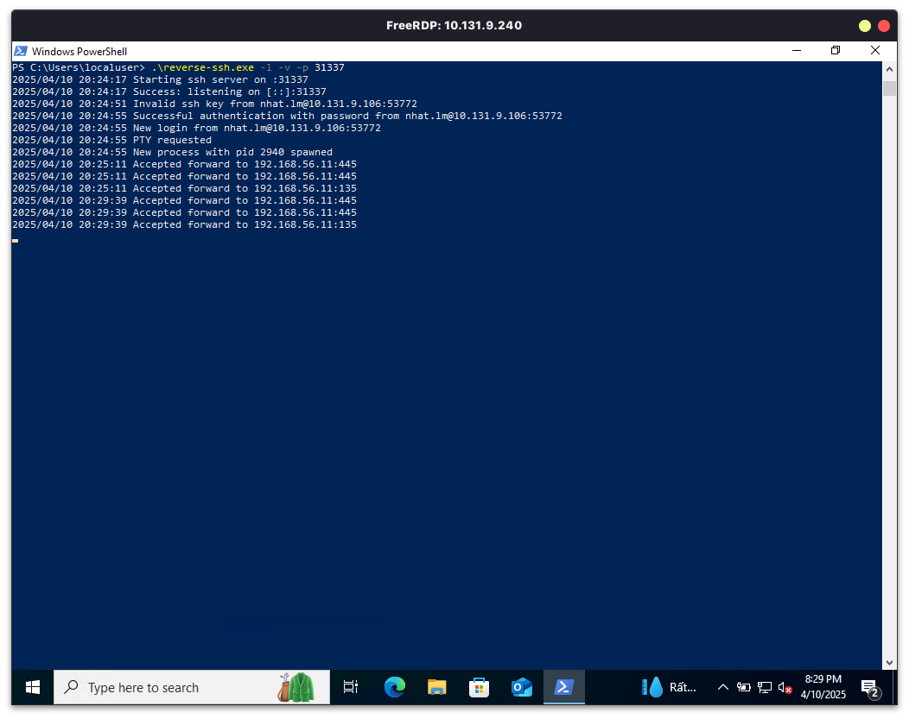

After we got reverse-ssh running on the system, we can now ssh in ```ssh -D 9050 -p 31337 10.131.9.240```. The proxy is now running at 127.0.0.1:9050 on the attacker machine, which is proxychains's default option.

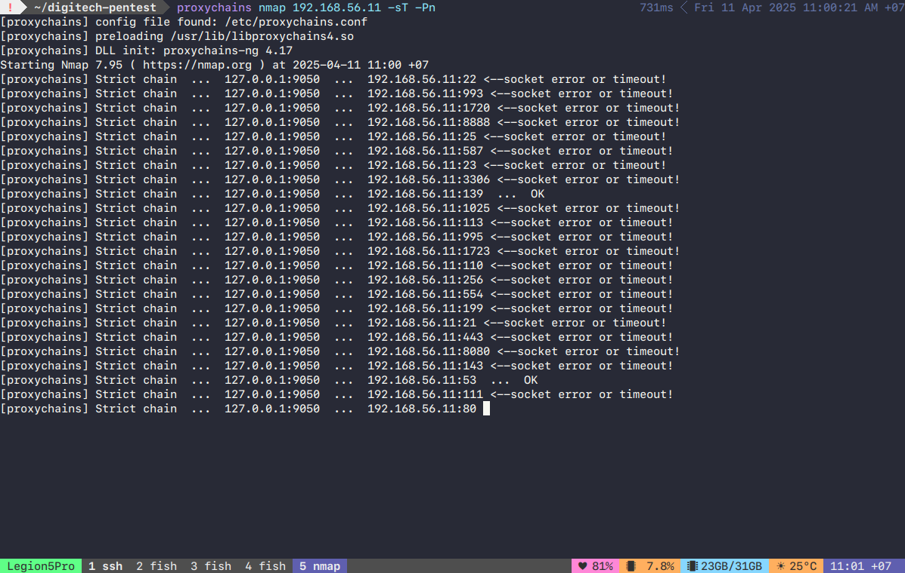

#### 3.3. Internal network enumeration

After a while of running nmap with the `-st` and `-Pn` to disable host discovery, we discovered there server hosts: 

```
Nmap scan report for 192.168.56.10
Host is up (0.00018s latency).
Not shown: 985 closed tcp ports (conn-refused)
PORT     STATE SERVICE
53/tcp   open  domain
80/tcp   open  http
88/tcp   open  kerberos-sec
135/tcp  open  msrpc
139/tcp  open  netbios-ssn
389/tcp  open  ldap
445/tcp  open  microsoft-ds
464/tcp  open  kpasswd5
593/tcp  open  http-rpc-epmap
636/tcp  open  ldapssl
3268/tcp open  globalcatLDAP
3269/tcp open  globalcatLDAPssl
3389/tcp open  ms-wbt-server
5985/tcp open  wsman
5986/tcp open  wsmans

Nmap scan report for 192.168.56.11
Host is up (0.00026s latency).
Not shown: 986 closed tcp ports (conn-refused)
PORT     STATE SERVICE
53/tcp   open  domain
88/tcp   open  kerberos-sec
135/tcp  open  msrpc
139/tcp  open  netbios-ssn
389/tcp  open  ldap
445/tcp  open  microsoft-ds
464/tcp  open  kpasswd5
593/tcp  open  http-rpc-epmap
636/tcp  open  ldapssl
3268/tcp open  globalcatLDAP
3269/tcp open  globalcatLDAPssl
3389/tcp open  ms-wbt-server
5985/tcp open  wsman
5986/tcp open  wsmans

Nmap scan report for 192.168.56.22
Host is up (0.000095s latency).
Not shown: 992 closed tcp ports (conn-refused)
PORT     STATE SERVICE
80/tcp   open  http
135/tcp  open  msrpc
139/tcp  open  netbios-ssn
445/tcp  open  microsoft-ds
1433/tcp open  ms-sql-s
3389/tcp open  ms-wbt-server
5985/tcp open  wsman
5986/tcp open  wsmans

```

From the scan, we can determine that there is a CI/CD and file server, and 2 domain controllers. Additionally there were a camera system but it was beyond the scope of this test per your request.

After wards we ran them through netexec to determine the hostname, roles and domain of the machine:

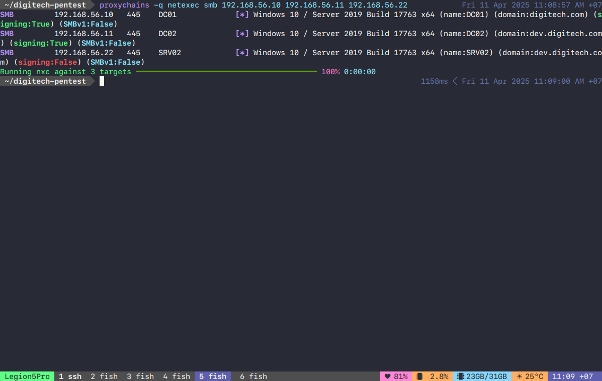

From here we can draw a relationship graph for all three of the top servers: 

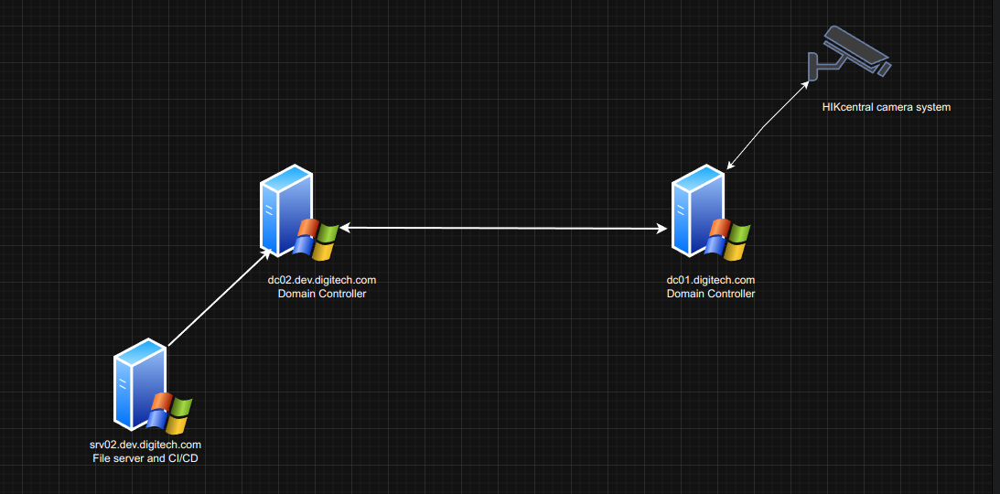

Next, we looked around for any protential entry point and we found out that the dc02 domain controller allows for RPC anonymous bind. RPC is short for Remote Procedure Call, which is a protocol that would allow a client/server relationship between processes locally or over the network over "pipes" (Jonathan, 2021), one of them is MS-SAMR, which allows for remote account management. In this case, we can abuse the anonymous user (null login) with rpcclient to enumerate users and their descriptions: 

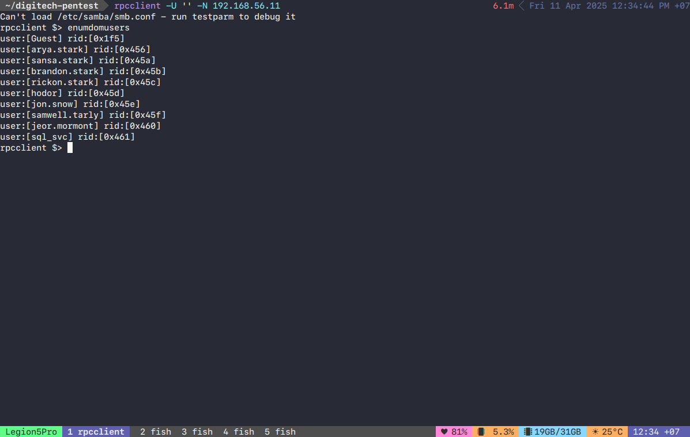

After taking a closer look at the users, we spotted user ```samwell.tarly``` with their password in their description: 

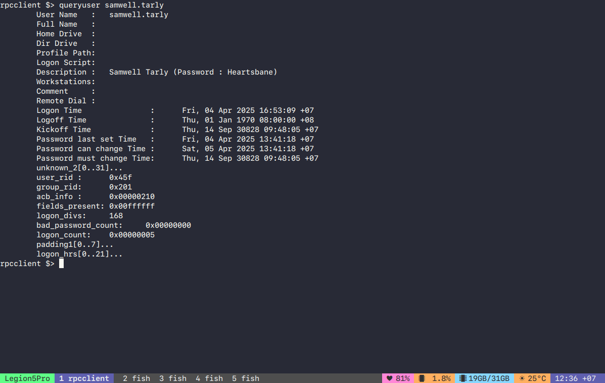

#### 3.4. Domain lateral movement

Running the account through netexec showed that `samwell` can Remote Desktop into SRV02. 

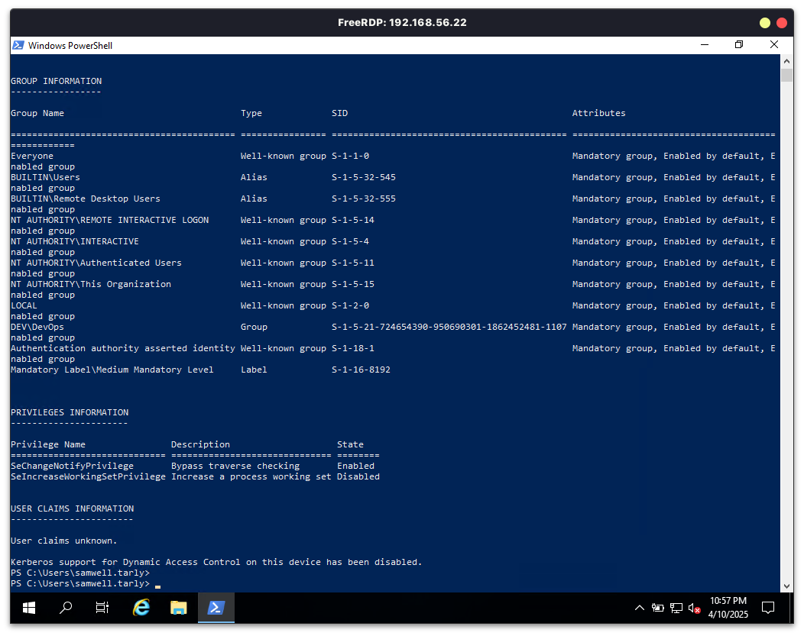

Next, we used SharpHound to collect all information of the dev.digitech.com Domain with the authenticated account:

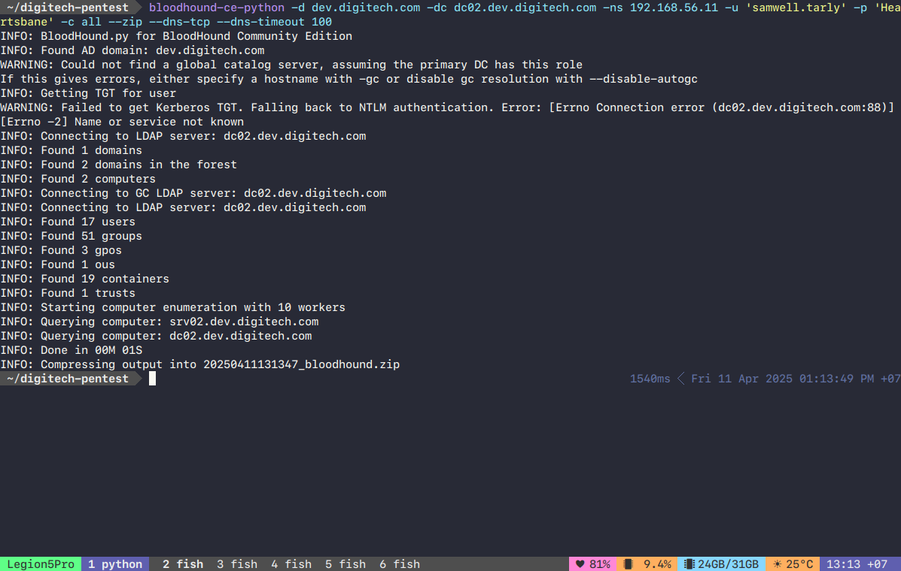

Then, we parsed the file through BloodHound to turn the data into graphs so that we can determine the "relationship" the objects (users, groups, etc) have with each other in the domain. 

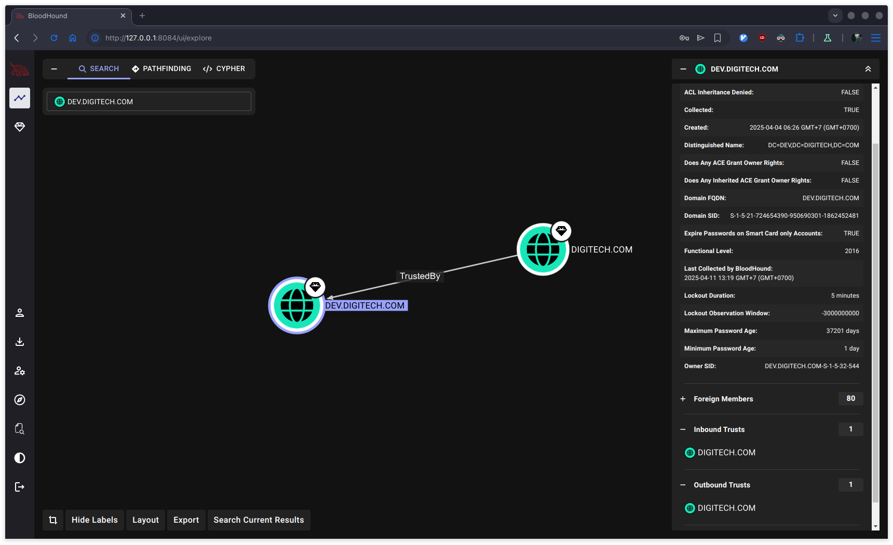

When we inspected the current user, we found out that they have full control over the "DefaultWallpaper" a Group Policy Object. 

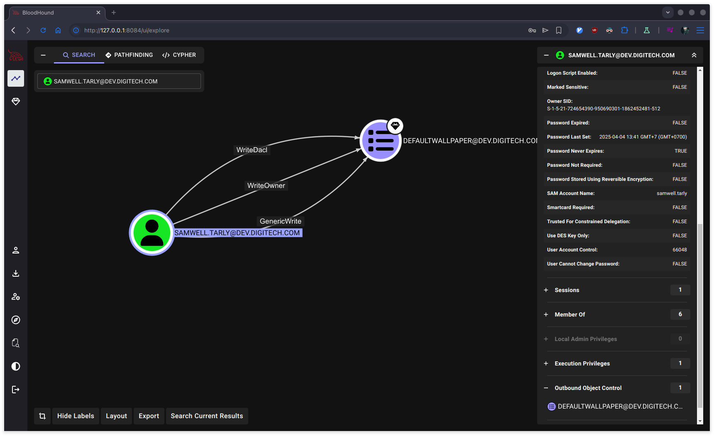

In Windows, a Group Policy Object is a set of rules for user, groups and computers. These rules can range from default wallpaper, startup programs, what rights an user have locally on that computer, can they be local admin on, etc (Microsoft Learn). 

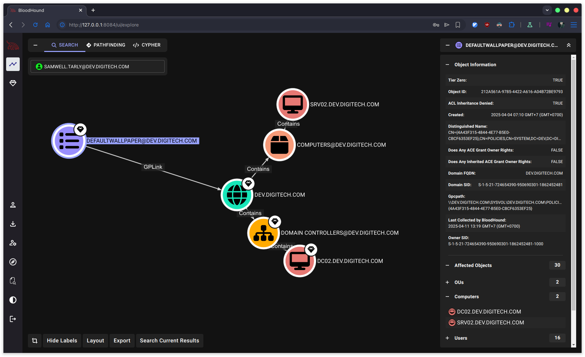

In this case, the ```DefaultWallpaper``` group policy object dictates the default wallpaper on DC02 and SRV02. With control of this group policy, we can hijack it to grant the current user local Administrator rights on DC02 and SRV02 with the usage of SharpGPOAbuse on SRV02 as samwell.tarly: 

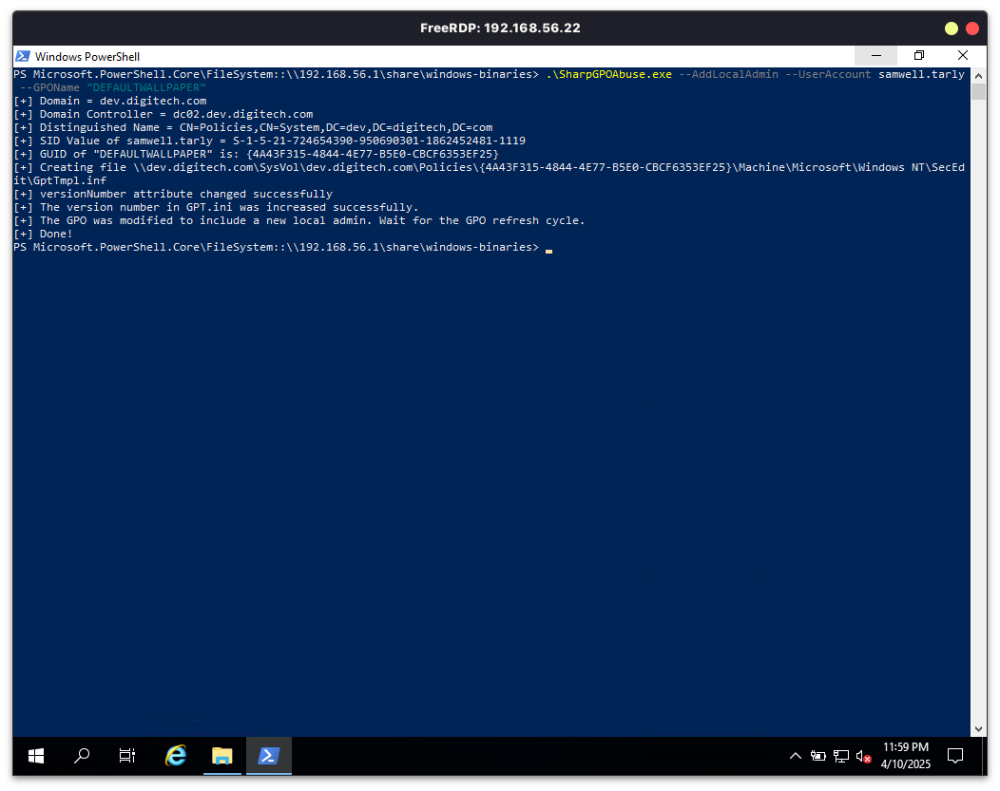

After the GPO was updated, we waited 90 minutes and we can now login as the local Administrator for SRV02 and DC02:

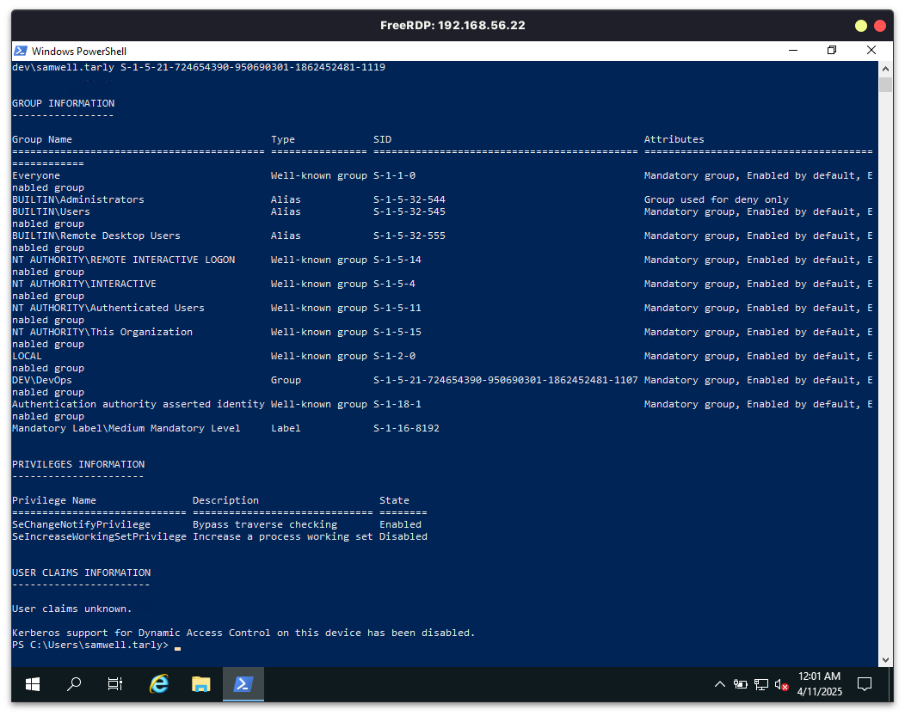

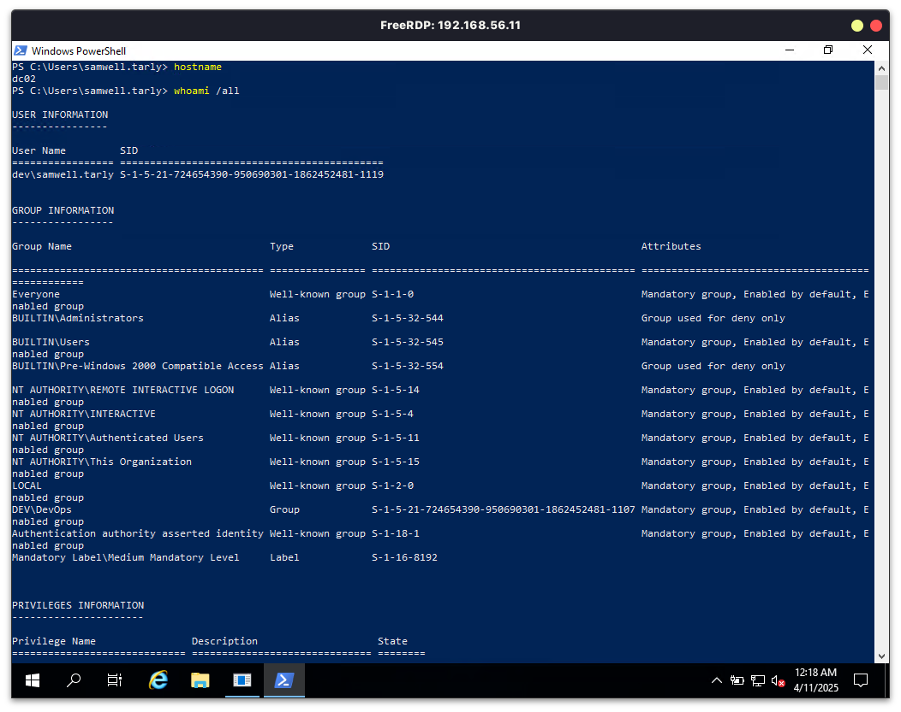

With local admin right on DC02, we can now dump all of the known domain NTLM credentials using the secretsdump script from the impacket packages: 

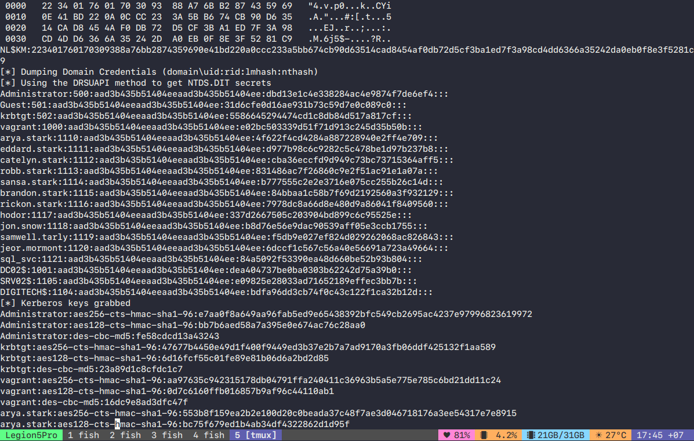

With the dev.digitech.com domain compromised, we are going after the main digitech.com domain which contains even more sensitive accounts and services. 


## IV. Assets and Security Controls Assurance Review

## V. Mitigations and Security Recommandations

## VI. References

Shebli, H.M. and Beheshti, B.D. (2018) ‘A study on penetration testing process and Tools’, 2018 IEEE Long Island Systems, Applications and Technology Conference (LISAT), pp. 1–7. doi:10.1109/lisat.2018.8378035. 

Review of the attacks associated with lapsus$ and related threat groups executive summary: CISA (2023) Cybersecurity and Infrastructure Security Agency CISA. Available at: https://www.cisa.gov/resources-tools/resources/review-attacks-associated-lapsus-and-related-threat-groups-executive-summary. 

Jonathan, J. (2021) RPC for Detection Engineers. Available at: https://specterops.io/wp-content/uploads/sites/3/2022/06/RPC_for_Detection_Engineers.pdf (Accessed: 12 April 2025). 

Group policy API (no date) Microsoft Learn. Available at: https://learn.microsoft.com/en-us/previous-versions/windows/desktop/policy/group-policy-start-page (Accessed: 13 April 2025). 

